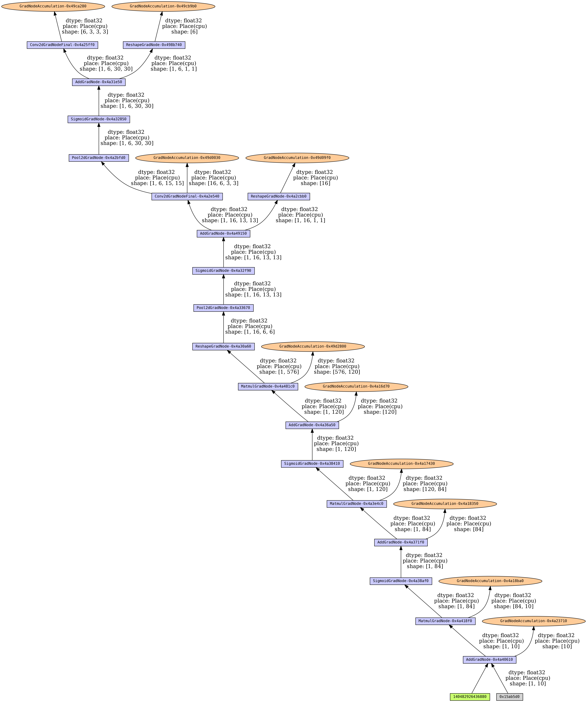
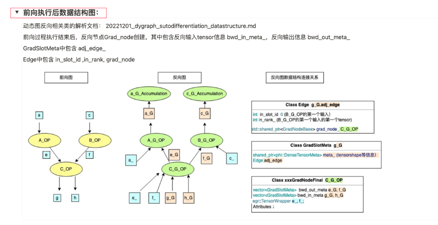

# paddleviz
一款适用于`PaddlePaddle`框架的反向图可视化工具。

## 概述
飞桨深度学习框架提供了动态图编程的模式来开发深度学习模型，但动态图的反向图调试能力仍存在不足。为了更好地追踪反向图执行流程，本项目为飞桨框架提供了反向图可视化能力。

## 安装
### paddle 版本
由于是新特性，运行本项目需要从[官网](https://www.paddlepaddle.org.cn/install/quick?docurl=/documentation/docs/zh/develop/install/pip/linux-pip.html)安装最新版本的`paddlepaddle`。

安装命令
```shell
python -m pip install paddlepaddle==0.0.0 -f https://www.paddlepaddle.org.cn/whl/linux/cpu-mkl/develop.html
```

### 其他依赖包
运行本项目需要提前安装第三方可视化工具包`graphviz`。

安装命令
```shell
pip install graphviz
```

## 使用
1. 首先需要定义网络模型以及可视化代码，下面是一个基本的使用例子。

在该示例`example.py`中，我们进行了以下步骤：
* 1. 将系统日志输出级别设为`6`。
* 2. 定义网络，调用网络前向推理过程，获取动态图网络的最终输出。
* 3. 调用`backward()`进行一次反向推理。
* 4. 调用本项目`paddleviz.viz`包下的`make_graph()`函数获取反向图可视化结果，函数返回值是一个`Digraph`类型的实例。
* 5. 调用`Digraph`实例的`render()`方法绘制并保存反向图可视化结果。

```python
import os
os.environ['GLOG_v'] = '6'

import paddle
import paddle.nn as nn

from paddleviz.viz import make_graph

class Model(nn.Layer):
    def __init__(self):
        super(Model, self).__init__()
        self.conv = nn.Sequential(
            nn.Conv2D(3, 6, 3, 1), # in_channels, out_channels, kernel_size
            nn.Sigmoid(),
            nn.MaxPool2D(2, 2), # kernel_size, stride
            nn.Conv2D(6, 16, 3, 1),
            nn.Sigmoid(),
            nn.MaxPool2D(2, 2)
        )
        self.fc = nn.Sequential(
            nn.Linear(16*6*6, 120),
            nn.Sigmoid(),
            nn.Linear(120, 84),
            nn.Sigmoid(),
            nn.Linear(84, 10)
        )

    def forward(self, img):
        feature = self.conv(img)
        output = self.fc(feature.reshape([img.shape[0], -1]))
        return output

if __name__ == '__main__':
    
    # 定义网络
    model = Model()
    x = paddle.randn([1, 3, 32, 32])

    # 正向推理
    y = model(x)

    # 反向推理
    y.sum().backward()

    # 可视化网络反向图，dpi 代表分辨率，默认为600，如果网络较大，可以改为更大的分辨率
    dot = make_graph(y, dpi="600")

    # 绘制保存反向图
    dot.render('viz-result.gv', format='png', view=False)
```
2. 定义好模型文件后，运行如下命令：
```
python paddleviz/run.py [模型调用文件路径，如example.py]
```

示例中网络的反向图可视化结果为：



## 原理
动态图在执行前向推理逻辑的同时，也会创建对应的反向图。反向图的数据结构如下图所示，其中每个节点都表示一个`算子(xx_OP)`，该算子节点会将`梯度信息(xx_G)`和`Tensor信息(xx_)`作为输入，计算并输出最终的反向梯度信息，然后输出的反向梯度信息作为下一个节点的输入，反复向上递归这一过程，直到到达不需要计算梯度的节点为止。



对于反向图中的每个节点通过调用其`next_functions()`函数来获取与他相连的反向结点，然后递归调用`add_nodes()`函数从而完成整个反向图的可视化。

模型反向推理时会输出日志，日志中包含每个算子输入输出的反向梯度信息，通过读取日志补充算子间边上详细信息，得到最终的反向图。