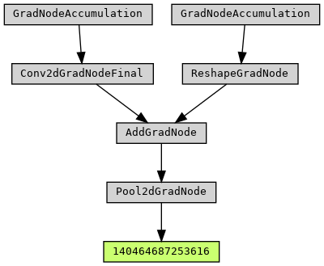

# paddleviz
一款适用于`PaddlePaddle`框架的反向图可视化工具。

## 概述
飞桨深度学习框架提供了动态图编程的模式来开发深度学习模型，但动态图的反向图调试能力仍存在不足。为了更好地追踪反向图执行流程，本项目为飞桨框架提供了反向图可视化能力。

## 安装
运行本项目需要提前安装第三方可视化工具包`graphviz`

安装命令
```shell
pip install graphviz
```

## 使用
下面是一个基本的使用例子
```python
import paddle
import paddle.nn as nn
from paddleviz.viz import make_graph

class Testmodel(nn.Layer):
    def __init__(self):
        super(Testmodel, self).__init__()
        self.conv = nn.Conv2D(3, 6, 3, 1)
        self.pool = nn.MaxPool2D(2, 2)

    def forward(self, x):
        x = self.conv(x)
        x = self.pool(x)
        return x 

model = Testmodel()
x = paddle.randn([1, 3, 24, 24])
y = model(x)
dot = make_graph(y)
dot.render('viz-result.gv', format='png', view=True)
```
在该示例中，我们进行了以下步骤：
* 1. 定义网络，调用网络前向推理过程，获取动态图网络的最终输出。
* 2. 调用本项目`paddleviz.viz`包下的`make_graph()`函数获取反向图可视化结果，函数返回值是一个`Digraph`类型的实例。
* 3. 调用`Digraph`实例的`render()`方法绘制并保存反向图可视化结果。

示例中网络的反向图可视化结果为：



## 原理
动态图在执行前向推理逻辑的同时，也会创建对应的反向图。反向图的数据结构如下图所示，其中每个节点都表示一个`算子(xx_OP)`，该算子节点会将`梯度信息(xx_G)`和`Tensor信息(xx_)`作为输入，计算并输出最终的反向梯度信息，然后输出的反向梯度信息作为下一个节点的输入，反复向上递归这一过程，直到到达不需要计算梯度的节点为止。


对于反向图中的每个节点通过调用其`next_functions()`函数来获取与他相连的反向结点，然后递归调用`add_nodes()`函数从而完成整个反向图的可视化。